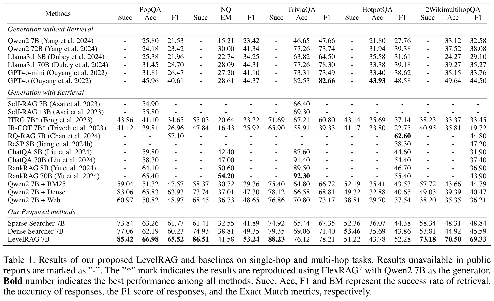

# LevelRAG: Enhancing Retrieval-Augmented Generation with Multi-hop Logic Planning over Rewriting Augmented Searchers


[](https://github.com/psf/black)
[](https://pycqa.github.io/isort/)
[](LICENSE)

本项目为论文 **LevelRAG: Enhancing Retrieval-Augmented Generation with Multi-hop Logic Planning over Rewriting Augmented Searchers** 的源码。

## 概览
LevelRAG 是一种两阶段的检索增强生成（RAG）框架，结合了多跳逻辑规划和混合检索，以提高检索过程的完整性和准确性。其中第一阶段采用一个高级搜索器，将用户查询分解为原子查询。第二阶段利用多个低级搜索器，为每个子查询检索最相关的文档，然后将相关信息汇总到高级搜索器中生成最终答案。在每个低级搜索器中，采用大型语言模型（LLMs）对原子查询进行适应性优化，以更好地适应低级搜索器中内置的检索器。

<center>

</center>


## 运行 LevelRAG

### 环境准备
本项目是基于 [FlexRAG](https://github.com/ictnlp/flexrag) 实现的。请参照以下命令安装 FlexRAG：

```bash
pip install flexrag==0.1.11
```

下载本项目源码：

```bash
git clone https://github.com/ictnlp/LevelRAG
```

### 准备检索器
在运行 LevelRAG 前，需要构建检索器。LevelRAG 使用了三种不同的检索器，分别是 `DenseRetriever`、`ElasticRetriever`和`WebRetriever` 。除了 `WebRetriever` 不需要构建索引外，`DenseRetriever` 和 `ElasticRetriever` 都需要先构建索引。在我们的实验中，我们使用了 [Atlas](https://github.com/facebookresearch/atlas) 提供的维基百科语料库。您可以通过以下命令下载语料库：


```bash
wget https://dl.fbaipublicfiles.com/atlas/corpora/wiki/enwiki-dec2021/text-list-100-sec.jsonl
wget https://dl.fbaipublicfiles.com/atlas/corpora/wiki/enwiki-dec2021/infobox.jsonl
```

下载完语料库后，您可以运行以下命令构建 `DenseRetriever`：

```bash
DENSE_PATH=wikipedia

python -m flexrag.entrypoints.prepare_index \
    retriever_type=dense \
    corpus_path=[text-list-100-sec.jsonl,infobox.jsonl] \
    saving_fields=[text] \
    dense_config.database_path=$DENSE_PATH \
    dense_config.passage_encoder_config.encoder_type=hf \
    dense_config.passage_encoder_config.hf_config.model_path=facebook/contriever-msmarco \
    dense_config.passage_encoder_config.hf_config.device_id=[0] \
    dense_config.encode_fields=[text] \
    dense_config.index_type=faiss \
    dense_config.batch_size=1024 \
    dense_config.log_interval=100000
```

类似的，您可以运行以下命令构建 `ElasticRetriever`：

```bash
python -m flexrag.entrypoints.prepare_index \
    retriever_type=elastic \
    corpus_path=[text-list-100-sec.jsonl,infobox.jsonl] \
    saving_fields=[text] \
    elastic_config.host='http://127.0.0.1:9200/' \
    elastic_config.index_name=wikipedia \
    elastic_config.batch_size=512 \
    elastic_config.log_interval=100 \
    reinit=True
```

> **Notice:**
> 在构建 `ElasticRetriever` 前，您需要安装 elasticsearch 。您可以参考[这里](https://www.elastic.co/guide/en/elasticsearch/reference/current/install-elasticsearch.html)的指令来安装 elasticsearch。

`WebRetriever` 不需要构建索引，但需要您事先准备 Bing Search API 的密钥。您可以访问 [Bing Search API](https://www.microsoft.com/en-us/bing/apis) 来获取密钥。


### 准备生成器
LevelRAG 使用 `Qwen2-7B-Instruct` 作为生成器，您可以通过以下命令使用 `vllm` 来部署生成器：

```bash
python -m vllm.entrypoints.openai.api_server \
    --model Qwen2-7B-Instruct \
    --gpu-memory-utilization 0.95 \
    --tensor-parallel-size 4 \
    --port 8000 \
    --host 0.0.0.0 \
    --trust-remote-code
```

该命令将使用 4 个 GPU 来部署 `Qwen2-7B-Instruct` 模型，您可以根据您的 GPU 数量和显存大小来调整 `--tensor-parallel-size` 和 `--gpu-memory-utilization` 参数。


### 启动 LevelRAG 评估
在完成检索器的准备后，您可以通过运行 `scripts` 文件夹中的 `run_highlevel.sh` 脚本来运行 LevelRAG 评估脚本。注意替换脚本中的变量：
- LEVELRAG_PATH：您在下载本项目源码时的路径
- DENSE_PATH: 您在构建 `DenseRetriever` 时保存的路径
- BING_KEY：您在准备 `WebRetriever` 时获取的 Bing Search API 密钥


### 启动 LevelRAG 图形界面
您也可以通过运行 `scripts` 文件夹中的 `run_highlevel_gui.sh` 脚本来启动 LevelRAG 的图形界面，在图形界面中您可以输入查询并查看 LevelRAG 的输出。

## 运行 Simple LevelRAG
如果您不希望使用 `WebRetriever` 及 `ElasticRetriever`。您可以仅使用 `DenseRetriever` 来运行 LevelRAG。得益于良好的多跳问题分解及子查询适应性优化， LevelRAG 在仅使用单一检索器时也能取得不错的效果，且运行速度更快。您可以通过运行 `scripts` 文件夹中的 `run_simple.sh` 脚本来运行 Simple LevelRAG 的评估脚本，或运行 `run_simple_gui.sh` 脚本来启动 Simple LevelRAG 的图形界面。

该脚本使用了 FlexRAG 项目提供的 `DenseRetriever` 检索器，因此您**无需构建索引**，直接运行脚本即可。

## 实验结果
我们在多个单跳及多跳知识密集型问答数据集上进行了实验。实验结果显示，相较于对比方法LevelRAG实现了非常显著的性能提升，实验结果请参考下表。

<center>

</center>

## 许可
本项目使用 MIT 许可证。有关更多信息，请参阅 [LICENSE](LICENSE) 文件。


## 引用
如果您觉得我们的工作对您有所帮助，请考虑引用我们的论文或 Star 本项目。
<!-- TODO: Add the citation here -->
```bibtex
```

如果您对本项目有任何问题，欢迎在 GitHub 上创建 issue 或通过邮件联系我们（zhangzhuocheng20z@ict.acn.cn）。
