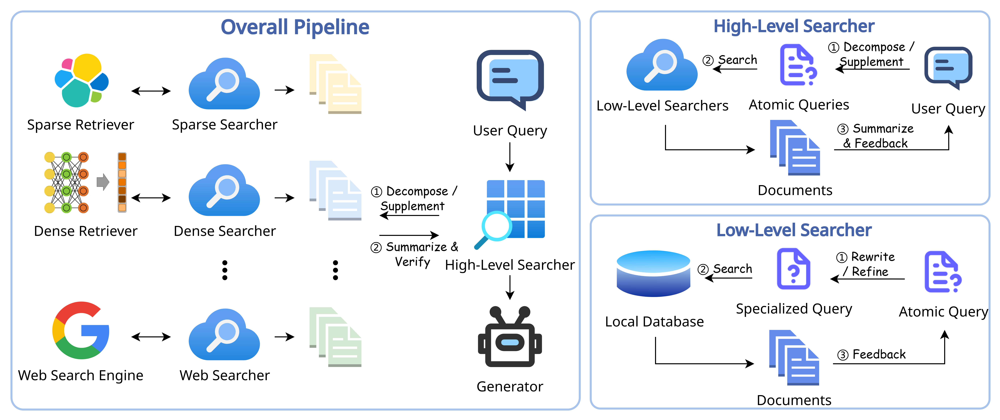

# LevelRAG: Enhancing Retrieval-Augmented Generation with Multi-hop Logic Planning over Rewriting Augmented Searchers

Source code for paper "LevelRAG: Enhancing Retrieval-Augmented Generation with Multi-hop Logic Planning over Rewriting Augmented Searchers".

## Overview
**LevelRAG** is a two-stage retrieval-augmented generation (RAG) framework that incorporates multi-hop logic planning and hybrid retrieval to enhance both completeness and accuracy of the retrieval process. The first stage involves a high-level searcher that decomposing the user query into atomic sub-queries. The second stage utilizes multiple low-level searchers to retrieve the most relevant documents for each sub-query, which are then used to generate the final answer. In each low-level searcher, large language models (LLMs) are employed to refine the atomic queries to better fit the corresponding retriever.

<center>

</center>


## Running LevelRAG

### Prepare the Environment
Our code is based on [FlexRAG](https://github.com/ictnlp/flexrag). Please follow the instruction to install FlexRAG:
```bash
pip install flexrag
```

### Prepare the Retriever
Before running the LevelRAG, preparing the retriever is necessary. LevelRAG employs three kind of retrievers in total, naming `dense retriever`, `sparse retriever`, and `web retriever`, respectively. Except for the `web retriever`, which does not require index construction, both the dense retriever and the sparse retriever need to prepare the index first. In our experiments, we use the wikipedia corpus provided by [Atlas](https://github.com/facebookresearch/atlas). You can download the corpus by running the following command:
```bash
wget https://dl.fbaipublicfiles.com/atlas/corpora/wiki/enwiki-dec2021/text-list-100-sec.jsonl
wget https://dl.fbaipublicfiles.com/atlas/corpora/wiki/enwiki-dec2021/infobox.jsonl
```

After downloading the corpus, you can run the following command to build the `dense retriever`:
```bash
python -m flexrag.entrypoints.prepare_index \
    retriever_type=dense \
    corpus_path=[text-list-100-sec.jsonl,infobox.jsonl] \
    saving_fields=[text] \
    dense_config.database_path=wikipedia \
    dense_config.passage_encoder_config.encoder_type=hf \
    dense_config.passage_encoder_config.hf_config.model_path=facebook/contriever-msmarco \
    dense_config.passage_encoder_config.hf_config.device_id=[0] \
    dense_config.encode_fields=[text] \
    dense_config.index_type=faiss \
    dense_config.batch_size=1024 \
    dense_config.log_interval=100000
```

Similarly, you can run the following command to build the `sparse retriever`:
```bash
python -m flexrag.entrypoints.prepare_index \
    retriever_type=elastic \
    corpus_path=[text-list-100-sec.jsonl,infobox.jsonl] \
    saving_fields=[text] \
    elastic_config.host='http://127.0.0.1:9200/' \
    elastic_config.index_name=wikipedia \
    elastic_config.batch_size=512 \
    elastic_config.log_interval=100 \
    reinit=True
```

> **Notice:**
> You need to setup the elasticsearch server first. You can follow the instruction [here](https://www.elastic.co/guide/en/elasticsearch/reference/current/install-elasticsearch.html) to install the elasticsearch server.


### Run the LevelRAG
After preparing the retriever, you can run the LevelRAG by running the scripts in the `scripts` folder.


## Citation
If you find our work useful, please consider citing our paper:
<!-- TODO: Add the citation here -->
```bibtex
```

If you have any questions, feel free to create an issue on GitHub or contact us via email (zhangzhuocheng20z@ict.acn.cn).