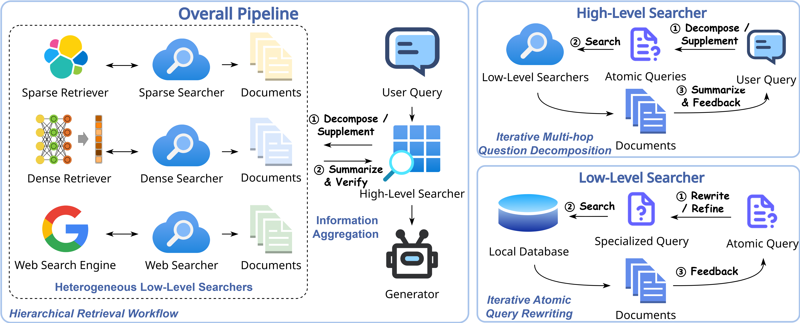
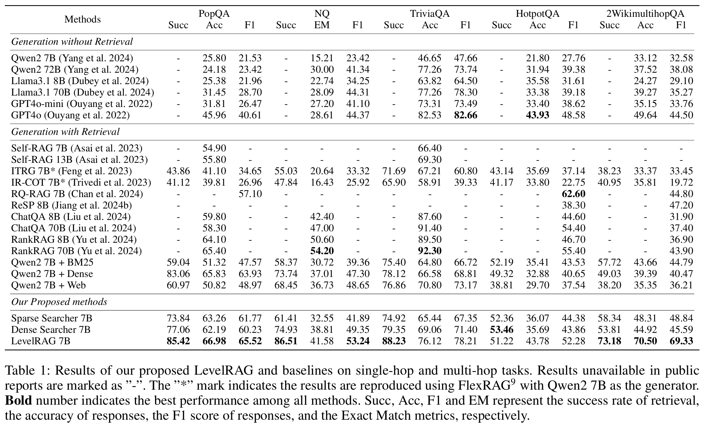

# LevelRAG: Enhancing Retrieval-Augmented Generation with Multi-hop Logic Planning over Rewriting Augmented Searchers


[](https://github.com/psf/black)
[](https://pycqa.github.io/isort/)
[](LICENSE)

<center>

\[ [English](README.md) | [中文](README-zh.md) \]

</center>

Source code for paper **"LevelRAG: Enhancing Retrieval-Augmented Generation with Multi-hop Logic Planning over Rewriting Augmented Searchers"**.

## Overview
**LevelRAG** is a two-stage retrieval-augmented generation (RAG) framework that incorporates multi-hop logic planning and hybrid retrieval to enhance both completeness and accuracy of the retrieval process. The first stage involves a high-level searcher that decomposing the user query into atomic sub-queries. The second stage utilizes multiple low-level searchers to retrieve the most relevant documents for each sub-query, which are then used to generate the final answer. In each low-level searcher, large language models (LLMs) are employed to refine the atomic queries to better fit the corresponding retriever.

<center>

</center>


## Running LevelRAG

### Prepare the Environment
Our code is based on [FlexRAG](https://github.com/ictnlp/flexrag) project. Please follow the instruction to install FlexRAG:
```bash
pip install flexrag==0.1.11
```

Download the source code of this project:
```bash
git clone https://github.com/ictnlp/LevelRAG
```

### Prepare the Retriever
Before running the LevelRAG, preparing the retriever is necessary. LevelRAG employs three kind of retrievers in total, naming `DenseRetriever`, `ElasticRetriever`, and `WebRetriever`, respectively. Except for the `WebRetriever`, which does not require index construction, both the `DenseRetriever` and the `ElasticRetriever` need to prepare the index first. In our experiments, we use the wikipedia corpus provided by [Atlas](https://github.com/facebookresearch/atlas). You can download the corpus by running the following command:

```bash
wget https://dl.fbaipublicfiles.com/atlas/corpora/wiki/enwiki-dec2021/text-list-100-sec.jsonl
wget https://dl.fbaipublicfiles.com/atlas/corpora/wiki/enwiki-dec2021/infobox.jsonl
```

After downloading the corpus, you can run the following command to build the `DenseRetriever`:
```bash
python -m flexrag.entrypoints.prepare_index \
    retriever_type=dense \
    file_paths=[text-list-100-sec.jsonl,infobox.jsonl] \
    saving_fields=[title,section,text] \
    id_field=id \
    dense_config.database_path=wikipedia \
    dense_config.passage_encoder_config.encoder_type=hf \
    dense_config.passage_encoder_config.hf_config.model_path=facebook/contriever-msmarco \
    dense_config.passage_encoder_config.hf_config.device_id=[0] \
    dense_config.encode_fields=[text] \
    dense_config.index_type=faiss \
    dense_config.batch_size=1024 \
    dense_config.log_interval=100000
```

Similarly, you can run the following command to build the `ElasticRetriever`:

```bash
python -m flexrag.entrypoints.prepare_index \
    retriever_type=elastic \
    file_paths=[text-list-100-sec.jsonl,infobox.jsonl] \
    saving_fields=[title,section,text] \
    id_field=id \
    elastic_config.host='http://127.0.0.1:9200/' \
    elastic_config.index_name=wikipedia \
    elastic_config.batch_size=512 \
    elastic_config.log_interval=100000 \
    reinit=True
```

> **Notice:**
> Before building the `ElasticRetriever`, you need to setup the elasticsearch server. You can follow the instruction [here](https://www.elastic.co/guide/en/elasticsearch/reference/current/install-elasticsearch.html) to install the elasticsearch server.

Using the `WebRetriever` does not require index construction. However, you need to prepare the Bing Search API_KEY in advance. You can visit [Bing Search API](https://www.microsoft.com/en-us/bing/apis) to get the API_KEY.

### Prepare the Genereator
LevelRAG uses the `Qwen2-7B-Instruct` as the generator. You can deploy the generator using `vllm` by running the following command:

```bash
python -m vllm.entrypoints.openai.api_server \
    --model Qwen2-7B-Instruct \
    --gpu-memory-utilization 0.95 \
    --tensor-parallel-size 4 \
    --port 8000 \
    --host 0.0.0.0 \
    --trust-remote-code
```

This command will deploy the `Qwen2-7B-Instruct` using 4 GPUs. You can adjust the `--tensor-parallel-size` and the `--gpu-memory-utilization` according to your own GPU configuration.


### Run the LevelRAG Evaluation Script
After preparing the retriever, you can run the LevelRAG by running the scripts in the `scripts` folder. Before running the scripts, make sure you have substituted the placeholder variables in the scripts with the correct values.

- LEVELRAG_PATH: The path to the LevelRAG repository.
- DENSE_PATH: The path to the `DenseRetriever`.
- BING_KEY: The Bing Search API_KEY.

### Run the LevelRAG GUI Demo
We also provide a GUI demo for LevelRAG. You can run the GUI demo by running the `run_highlevel_gui.sh` script in the `scripts` folder. In the GUI, you can input the query and view the output of LevelRAG.

## Running the Simple LevelRAG
If you think building the retriever is too complicated, you can run the simple version of LevelRAG by running the 
`run_simple.sh` script in the `scripts` folder. The simple version of LevelRAG only uses the `DenseRetriever` and does not require the `WebRetriever` and the `ElasticRetriever`. Thanks to the good multi-hop problem decomposition and sub-query adaptivity optimization, LevelRAG can achieve good performance even with a single retriever, and the running speed is faster. You can also run the `run_simple_gui.sh` script to start the GUI application of the simple version of LevelRAG.

## Experimental Results
We conducted experiments on multiple single-hop and multi-hop knowledge-intensive question answering datasets. The experimental results show that, compared to the baseline method, LevelRAG achieves a significant performance improvement. Please refer to the table below for the experimental results.

<center>

</center>

## License
This project is licensed under the MIT License - see the [LICENSE](LICENSE) file for details.

## Citation
If you find our work useful, please consider citing our paper:
<!-- TODO: Add the citation here -->
```bibtex
```

If you have any questions, feel free to create an issue on GitHub or contact us via email (zhangzhuocheng20z@ict.acn.cn).